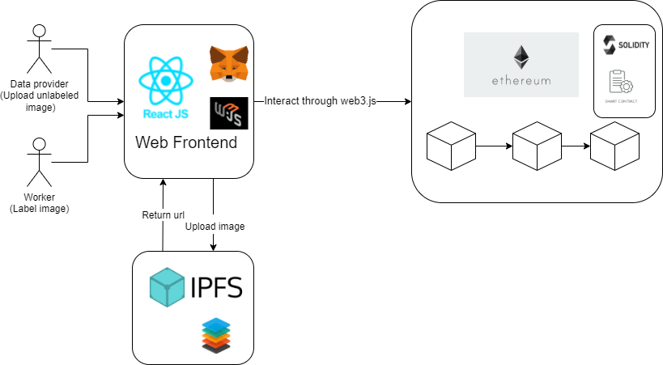

# Image Labeling to Earn! :moneybag:
Image Labeling to Earn is a simple DApp (Decentralized Application) that make people solve trivial tasks and earn little money. 

There are two roles in thie Dapp, **data provider and labeler.** Data provider provide small fee and their unlabeled images, which may be further used into machine learning training. 

On the other side, labeler get unlabeled image from DApp, then label these images and earn little money. This tasks is simple and suitable for people who want to relax himself and earn money at the same time.

## Architecture :european_castle:


## Getting Started :hammer:
> Note: Instructions below are for **local development environment**. For interaction with Ropsten testnet smart contract, please refer to [this branch](https://github.com/CyCTW/ImageLabel-DApp)
### Truffle setup
Open first terminal, then run:
```
truffle develop
```
This command will enter a truffle command line and run a local ganache blockchain in background.

- Compile contract
```
compile
```
- Migrate contract
```
migrate
```

### Frontend
Open second terminal, then run:

- Install packages
```
cd client && yarn install
```
- Run frontend in localhost
```
yarn start
```
After starting frontend, connect Metamask wallet with Ganache localnet  account.

#### Build frontend
```
yarn build
```

## Running Test
```
truffle test
```
## Reference
- [Medium](https://cyctw-cs.medium.com/dapp-build-guide-with-truffle-and-reactjs-dd4f61655754)

    A simple guide for building DApp.
- [Demo video](https://youtu.be/WRLkC9IMe-s)

    Simple Demo Video.
- [Slides](https://docs.google.com/presentation/d/1BIIPAiCVgMo-qrHelZdK2Y-IWCSYGpPZZpPJcUw5dBI/edit?usp=sharing)

    Slides that introduces the whole project.